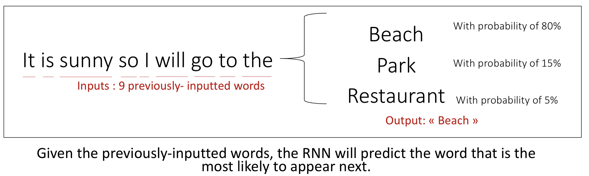
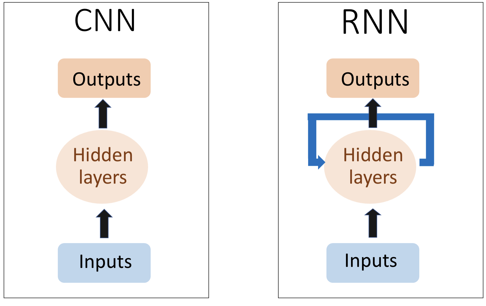
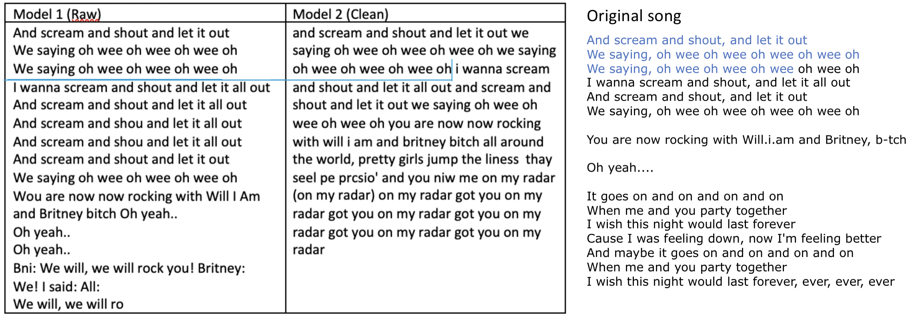

# Text Generation Report


## Generating text with Neural Networks: Theory
### The models

Reading the literature and internet resources on Medium and Towardsdatascience, we quickly understood that the most common and efficient way to do text generation was to build a LSTM Recurrent Neural Network. What are LSTM RNN and why are they so useful in the case of text generation ? We will first explain why should we use RNN in the case of sequential data, then we will detail the structure and limitations on RNN. Then, we will present LSTM RNN and our current modelling choices.

* **Recurrent Neural Networks (RNN) and sequential data**

Why should we use a RNN rather than a regular convolutionnal feed-forward neural network? This comes from the fact we are dealing with sequential data rather than fixed-point data. Let's first take an example to understand. 

Let's say that we are aiming at predicting weather for the next day. The weather for the next day depends on multiple variables at the current day such as humidy percentage, wind intensity, brightness percentage... This would fit the modelling a convolutionnal feed-forward neural network. However, it is likely that weather conditions for the next day depend on weather conditions in the last few days and that this depency on time is one of the most important features of the model. Here using a CNN would mean making an independency assumption on all test observations at the day level while using an RNN enables to represent the time dependency. 

With textual data at the letter/word/sentence level, our data is actually sequential. With text generation, our goal is to predict n number of characters  after an inputed string of text. For example, with n=1:



* **The structure and limitations of Recurrent Neural Networks (RNN)** 

Now that we have understood why we need to use a RNN, we will dwell on what is actually a RNN and how it makes it possible to take into account the time dependency. The following image explains in a simple manner the difference between an RNN and a CNN :



While the CNN is "feed-forward", the RNN instaures loops within the networks which allows the information to persist. This will allow the context to persist within the network. For more detailed  insights on how RNN works, see article X, X and X from the bibliography.

However, RNN have one main limitation: there is a limit at how they can handle sequences. While RNN are good for remembering short sequences,they tend to "forget" the overall context of the sentence. For example, it will work quite well on small sentences like "I want to eat ..." but will have trouble to predict for a long sentence. For text generation, we also need a model that is able to remember information from the past, ie. several sentences ago, which RNN cannot do. 

This limit comes from the vanishing gradient. 

"In order to understand this, you’ll need to have some knowledge about how a feed-forward neural network learns. We know that for a conventional feed-forward neural network, the weight updating that is applied on a particular layer is a multiple of the learning rate, the error term from the previous layer and the input to that layer. Thus, the error term for a particular layer is somewhere a product of all previous layers’ errors. When dealing with activation functions like the sigmoid function, the small values of its derivatives (occurring in the error function) gets multiplied multiple times as we move towards the starting layers. As a result of this, the gradient almost vanishes as we move towards the starting layers, and it becomes difficult to train these layers.

A similar case is observed in Recurrent Neural Networks. RNN remembers things for just small durations of time, i.e. if we need the information after a small time it may be reproducible, but once a lot of words are fed in, this information gets lost somewhere. This issue can be resolved by applying a slightly tweaked version of RNNs – the Long Short-Term Memory Networks."

* **One solution: LSTM RNN**

LSTM networks have quite complicated architecture, so we will only go over the intuition. One can check article X for more details.


### Our modeling choice

We decided to carry on this project by using a long short-term memory recurrent neural network in Python with Keras. Our model will proceed character-by-character (rather than word-by-word or paragraph-by-paragraph). We decided to go with word-level computing because our data sample is quite small and the computation power of our computers is also limited.

### Our evaluation method

It is hard to evaluate the text generated by an algorithm as there is no metrics such as accuracy or f1 score here.

2 criteria for evaluating text generation:
* Text quality: Is it understandable, is the grammar good, are the words correct?
* Diversity: Does the model always predict the same kind of sentence ? 

https://www.sciencedirect.com/science/article/pii/S1319157820303360

Exemple de metrics et le code python associé:
https://towardsdatascience.com/how-to-evaluate-text-generation-models-metrics-for-automatic-evaluation-of-nlp-models-e1c251b04ec1


## Generating text with Neural Networks: Practice
### Our data and data preparation 
To test and train our model, we have to use textual data. We tried on different datasets to test and understand how RNN work:
Different books from the Gutenberg project, an open source website that proposes royalty-free books. 
Different song lyrics classified by artists, one text file by artist.
One large dataset composed of fake news articles. The goal was to produce a fake news generator. Unfortunately the dataset was huge and the sentence structure/vocabulary was more complicated/less clean than using directly text from a book or song lyrics from an artist. Even after cleaning, running the model through this dataset was too time consuming.

Hence we decided on using the song lyrics datasets that would enable us to more clearly understand and build our model. From all the text files that we had we chose Britney spears' song lyrics. We chose her because the size of the text file was one of the biggest, hence we have enough material to train our model.

Data preparation

Creation of character mapping
During this step, we map each unique character of the text to a number. If we were to proceed by word level, each word would be embedded to a number meaning the size of our input would be much more important. In our case we worked at the character level. Hence, we only have 76 unique characters associated to an integer from 0 to 75. The different characters found in the song lyrics are lowercase letters (a-z), uppercase letters (A-Z), punctuation (' ', ',', '!', ...) and line break ('\n'). Our text is now a sequence of integers.

Model structure

We then extract all the possible sequences of 100 characters from our text and we store them into a vector X. For each sequence, the follow up character (the target) is stored into another vector Y. So X is our train set and Y our target set. From a sequence of 100 characters, our model will try to predict the next one. We shift our sequence of one character form our initial text and predict the follow up character. We proceed in this way for all the possible sequences stored in X. We also format the X and Y vectors in the right shape for the LSTM model.


### fitting the model

We tried several models with different number of layers, different number of neurons by layer but the best model that we were able to train and test in the amount of time that we had is the folowing : 

```
model = Sequential()
model.add(LSTM(400, input_shape=(X_modified.shape[1], X_modified.shape[2]), return_sequences=True))
model.add(Dropout(0.2))
model.add(LSTM(400))
model.add(Dropout(0.2))
model.add(Dense(Y_modified.shape[1], activation='softmax'))

model.compile(loss='categorical_crossentropy', optimizer='adam')
```


### Generating texts: outputs and insights




## Conclusion and extensions


### Bibliography
RNN structure:
https://medium.com/mindorks/understanding-the-recurrent-neural-network-44d593f112a2
long term short term memory: https://www.analyticsvidhya.com/blog/2017/12/fundamentals-of-deep-learning-introduction-to-lstm/
