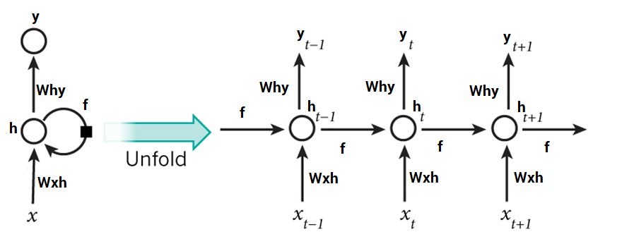

# Text Generation Report

Intro

## Generating text with Neural Networks: Theory
### The models

Reading the literature and internet resources on Medium and Towardsdatascience, we quickly understood that the most common and efficient way to do text generation was to build a LSTM Recurrent Neural Network. What are LSTM RNN and why are they so useful in the case of text generation ? We will first explain what should we use RNN in the case of sequential data, then we will detail the structure and limitations on RNN. Then, we will present LSTM RNN and our current modelling choices.

* **Recurrent Neural Networks (RNN) and sequential data**

Why should we use a RNN rather than a regular convolutionnal feed-forward neural network? This comes from the fact we are dealing with sequential data rather than fixed-point data. Let's first take an example to understand. 

Let's say that we are aiming at predicting weather for the next day. The weather for the next day depends on multiple variables at the current day such as humidy percentage, wind intensity, brightness percentage... This would fit the modelling a convolutionnal feed-forward neural network. However, it is likely that weather conditions for the next day depend on weather conditions in the last few days and that this depency on time is one of the most important features of the model. Here using a CNN would mean making an independency assumption on all test observations at the day level while using an RNN enables to represent the time dependency. 

With textual data at the letter/word/sentence level, our data is actually sequential. With text generation, our goal is to predict n number of characters  after an inputed string of text. For example, with n=1:

* **The structure and limitations of Recurrent Neural Networks (RNN)** 

Now that we have understood why we need to use a RNN, we will dwell on what is actually a RNN and how it makes it possible to take into account the time dependency.

BUT : « the curse of short-term memory » : decay of information overtime 
https://www.analyticsvidhya.com/blog/2017/12/fundamentals-of-deep-learning-introduction-to-lstm/
* One solution: LSTM RNN

* **Text generation and LSTM RNN**

### Our modeling choice

We decided to carry on this project by using a long short-term memory recurrent neural network in Python with Keras. Our model will proceed character-by-character (rather than word-by-word or paragraph-by-paragraph). We decided to go with word-level computing because our data sample is quite small and the computation power of our computers is also limited.

### Our evaluation method

It is hard to evaluate the text generated by an algorithm as there is no metrics such as accuracy or f1 score here.

2 criteria for evaluating text generation:
* Text quality: Is it understandable, is the grammar good, are the words correct?
* Diversity: Does the model always predict the same kind of sentence ? 

https://www.sciencedirect.com/science/article/pii/S1319157820303360

Exemple de metrics et le code python associé:
https://towardsdatascience.com/how-to-evaluate-text-generation-models-metrics-for-automatic-evaluation-of-nlp-models-e1c251b04ec1

## Generating text with Neural Networks: Practice
### Our data and data preparation 
To test and train our model, we have to use textual data. We tried on different datasets to test and understand how RNN work:
Different books from the Gutenberg project, an open source website that proposes royalty-free books.
One large dataset composed of fake news articles. The goal was to produce a fake news generator. Unfortunately the dataset was huge and the sentence structure/vocabulary was more complicated/less clean than using directly text from a book. Even after cleaning, running the model through this dataset was too time consuming. 

Hence we decided on using the book datasets that would enable us to more clearly understand and build our model. 

Data preparation

Creation of character mapping
During this step, we map each unique character of the text to a number. If we were to proceed by word level, each word would be embedded to a number meaning the size of our input would be much more important (? Pas sure).

### fitting the model
### Generating texts: outputs and insights

## Conclusion and extensions

