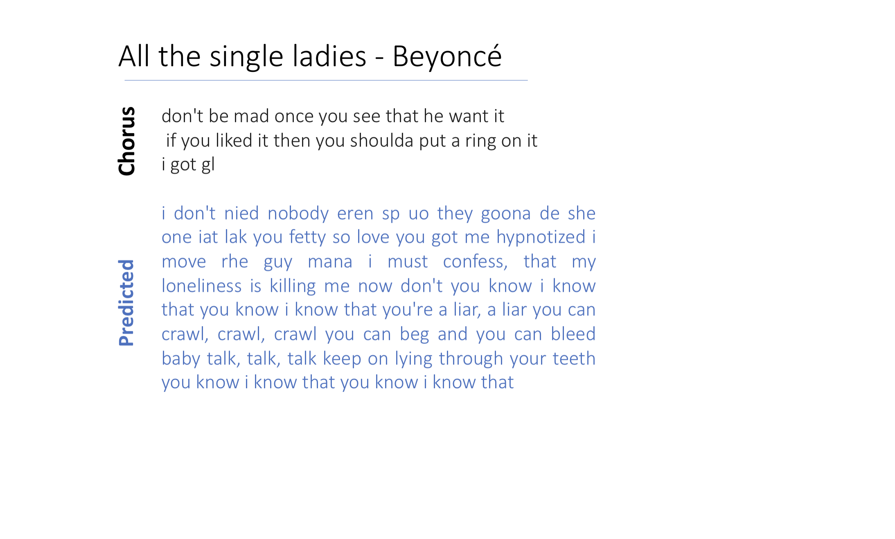

# Text Generation Report
**Léa Vaysette - Alice Tourret**

## Generating text with Neural Networks: Theory
### The models

Reading the literature and internet resources on Medium and Towardsdatascience, we quickly understood that the most common and efficient way to do text generation was to build a long short-term memory Recurrent Neural Network (LSTM RNN). What are LSTM RNN and why are they so useful in the case of text generation ? We will first explain why we should use RNN in the case of sequential data, then we will detail the structure and limitations on RNN. Then, we will present quickly LSTM RNN and our current modelling choices.

* **Recurrent Neural Networks (RNN) and sequential data**

Why should we use a RNN rather than a regular convolutionnal feed-forward neural network? This comes from the fact we are dealing with sequential data rather than fixed-point data. Let's first take an example to understand. 

Let's say that we are aiming at predicting weather for the next day. The weather for the next day depends on multiple variables at the current day such as humidy percentage, wind intensity, brightness percentage... This would fit a convolutionnal feed-forward neural network (CNN). However, it is likely that weather conditions for the next day depend on weather conditions in the last few days and that this depency on time is one of the most important features of the model. Here using a CNN would mean making an independency assumption on all test observations at the day level while using an RNN enables to represent the time dependency. 

With textual data at the letter/word/sentence level, our data is actually sequential. With text generation, our goal is to predict n letter/word/sentence after an inputed string of text. For example, with n=1 at the word level:


* **The structure and limitations of Recurrent Neural Networks (RNN)** 

Now that we have understood why we need to use a RNN, we will dwell on what is actually a RNN and how it makes it possible to take into account the time dependency. The following image explains in a simple manner the difference between an RNN and a CNN :


While the CNN is "feed-forward", the RNN instaures loops within the networks which allows the information to persist. This will allow the context to persist within the network. For more detailed  insights on how RNN works, see article 1 from the bibliography.

However, RNN have one main limitation: there is a limit at how they can handle sequences. While RNN are good for remembering short sequences,they tend to "forget" the overall context of the sentence. For example, it will work quite well on short sentences such as "I want to eat ..." but will have trouble to predict for a long sentence. For text generation, we also need a model that is able to remember information from the past, ie. several sentences ago, which RNN cannot do. 

This limit comes from the vanishing gradient. At each iteration of training, the gradient used to optimize the network will become increasingly small. In some cases, this issue prevents RNN to hangle long texts and sequences (see article 3). 

* **One solution: LSTM RNN**

LSTM networks have quite complicated architecture, so we will only go over the intuition. One can check article 2 for more details.
The following image is taken from the course and represents the structure of a LSTM RNN. The difference with a regular RNN is that cells of LSTM RNN are more complex: each cell have 3 kind of "gates".


Such a structure will enable a choice between important and less important inputs and avoid the vanishing gradient issue.


### Our modeling choice

We decided to carry on this project by using a long short-term memory recurrent neural network in Python with Keras. Our model will proceed character-by-character (rather than word-by-word or paragraph-by-paragraph). We decided to go with word-level computing because our data sample is quite small and the computation power of our computers is also limited.

### Our evaluation method

After training the RNN on our data, we realized it is hard to evaluate the text generated by an algorithm as there is no metrics such as accuracy or f1 score here.

After our own experience but also some reading (4) , we decided on two "subjective" criteria for evaluating text generation:
* *Text quality*: Is the generated text understandable, is the grammar good, are the words correct?
* *Diversity*: Does the model always predict the same kind of sentence ? 

We also read about metrics such as perplexity to evaluate text generation. However, these metrics are quite hard to implement and not always the best way to evaluate the predictions (5). However, an extension of our work could be to implement them to have a better understanding. 

## Generating text with Neural Networks: Practice
Concerning the code, we mostly took as a base the code from the Deep Learning part 2 course and from this text generation github : https://github.com/annikabrundyn/rnn_text_generation

### Our data and data preparation 
To test and train our model, we have to use textual data. We tried on different datasets to test and understand how RNN work:
* Different books from the Gutenberg project, an open source website that proposes royalty-free books. 
* Different song lyrics classified by artists (one text file by artist).
* One large dataset composed of fake news articles. The goal was to produce a fake news generator. Unfortunately the dataset was huge and the sentence structure/vocabulary was more complicated/less clean than using directly text from a book or song lyrics from an artist. Even after cleaning, running the model through this dataset was too time consuming.

Hence we decided on using the song lyrics datasets that would enable us to more clearly understand and build our model. From all the text files that we had we chose Britney spears' song lyrics. We chose her because the size of the text file was one of the biggest, hence we have enough material to train our model.

**Data preparation**

Creation of character mapping.
During this step, we map each unique character of the text to a number. If we were to proceed by word level, each word would be embedded to a number meaning the size of our input would be much more important. In our case we worked at the character level. Hence, we only have 76 unique characters associated to an integer from 0 to 75. The different characters found in the song lyrics are lowercase letters (a-z), uppercase letters (A-Z), punctuation (' ', ',', '!', ...) and line break ('\n'). Our text is now a sequence of integers.

**Model structure**

We then extract all the possible sequences of 100 characters from our text and we store them into a vector X. For each sequence, the follow up character (the target) is stored into another vector Y. So X is our train set and Y our target set. From a sequence of 100 characters, our model will try to predict the next one. We shift our sequence of one character form our initial text and predict the follow up character. We proceed in this way for all the possible sequences stored in X. We also format the X and Y vectors in the right shape for the LSTM model.


### fitting the model

**Creation of the model**

We tried several models with different number of layers, different number of neurons by layer but the best model that we were able to train and test in the amount of time that we had is the following : 

```
model = Sequential()
model.add(LSTM(400, input_shape=(X_modified.shape[1], X_modified.shape[2]), return_sequences=True))
model.add(Dropout(0.2))
model.add(LSTM(400))
model.add(Dropout(0.2))
model.add(Dense(Y_modified.shape[1], activation='softmax'))

model.compile(loss='categorical_crossentropy', optimizer='adam')
```
This model is quite big but smaller models gave us bad results. We could add layers or neurons in the different layers but it increases the computanial time. This model was a good trade-off between efficiency and speed.
The dropout layers are here to take care of the overfitting.
The final layer outputs a character, our prediction for each sequence of 100 characters.

**Training of the model**

We have a part that create checkpoints everytime the model is improving. Thus, we are able to save a model, to go back in time if the loss increases from one epoch to the next one or add epochs without starting over each time. We tested different values for the batch size. The optimal size, ie that gave good results and was not too time consuming, is 128. We trained our model and saved the checkpoint with the lowest loss.

### A second model

To improve our model, an additional step at the beggining of the process could help. A cleaning part that will reduce the number of different characters from 76 to 50 by removing the punctuation and the break line. For the prediction, the model will have less possible choices, so it is more likely to have a good prediction. The main drawback for this model is that we will never have a break line thus it will be less structured like song lyric.

### Generating texts: outputs and insights

We generate the next characters by shifting the sequence by one character adding the predicted character at the end of the sequence each time :

**First sequence from the initial text**

them candles hanging
Hanging from the ceiling low
We use our bodies to make our own videos
Put on ou

**Second sequence with the first predicted character**

hem candles hanging
Hanging from the ceiling low
We use our bodies to make our own videos
Put on ou**r**

and so on ...

We fixed a starting point to compare the models. Our seed is : 

" And scream and shout and let it out
We saying oh wee oh wee oh wee oh
We saying oh wee oh wee oh wee "

We generate the next 400 characters, here is our result :


As expected we loose the structure of our initial text in our second model. 

As a recall, our two "subjective" criteria for evaluating text generation are:
* *Text quality*: Is the generated text understandable, is the grammar good, are the words correct?
* *Diversity*: Does the model always predict the same kind of sentence ?

For both models, text quality is pretty good: most of the sentences and words are understandable, though there are some typos within the generated text. However diversity is not so good as both predictions seems to get "stuck" on a phrase at one point or the other. We did train our model on song lyrics, which contains lots of repetitions (for chorus for example), so this result makes sense. 

After predicting on our train data, we need to try generating text with the Britney Spears' model on a test song. Here are the results for the song "Single Ladies" of Beyonce. We tried on other songs (see the code for one more example), but choose this one as the style is closer to Britney Spear's style. Indeed, as her songs are quite simple and not so rich with vocabulary, it would not make so much sense to try and predict Shakespears' poems (for example) with the model. 



There is definitely a drop in term of text quality in the first line as the text is not quite understandable. Diversity is quite good, though there is a few repetition with the verb "know". Overall, we were quite happy with the results, though there is room for improvement. It is possible the model is overfitting, as it is returning entire sequences of text ("my loneliness is killing me", Baby One More Time, Britney Spears), rather then creating original sentences. 

**extensions**

To get better text quality and diversity, we could widen the model by inputting more hidden layer and using a bigger dataset. However, our models are already quite slow, so we decided on this trade-off between text quality and speed. With more power and more time, one could surely improve the model.
One other thing that could be interesting to do is to implement the metrics mentionned in the theory parts of this report. This could help us understand where our model fails and how we could improve it. 


### Bibliography
(1) https://medium.com/mindorks/understanding-the-recurrent-neural-network-44d593f112a2

(2) https://www.analyticsvidhya.com/blog/2017/12/fundamentals-of-deep-learning-introduction-to-lstm/

(3) https://medium.com/datadriveninvestor/how-do-lstm-networks-solve-the-problem-of-vanishing-gradients-a6784971a577

(4) https://www.sciencedirect.com/science/article/pii/S1319157820303360

(5) https://www.sciencedirect.com/science/article/pii/S1319157820303360

